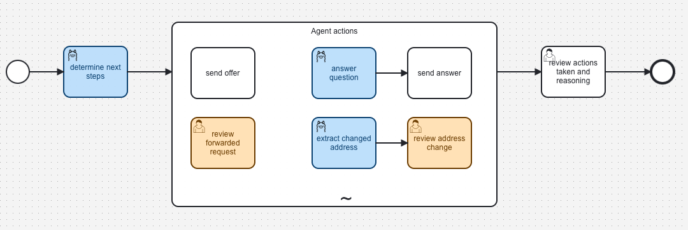

# Connect local Ollama to Camunda
## project description
This is a small sunday project of mine, that focuses on demoing the use of a locally running Ollama installation within Camunda processes. It currently allows you to do the following cool things:
* chat completion
* chat completion with images (for multimodal LLMs)
* agentic actions (via Camundas ad_hoc processes)

## prerequisits
### (optional) Setup Camunda locally
* follow the installation at Camunda [via Docker Compose](https://docs.camunda.io/docs/self-managed/setup/deploy/local/docker-compose/)
### add necessary Document-Handling settings:


You will find all necessary instructions to set up Document-Handling within Docker Compose [Camundas Documentation](https://docs.camunda.io/docs/self-managed/document-handling/configuration/docker/)

### once Camunda started up go to its WebModeler and deploy the resources from:
[process resources](src/main/resources/processresources)
[connector-template](src/main/resources/connector)

<picture>

</picture>

### start this application here
```
mvn spring-boot:run
```
## Ollama Models
I tested this process with: mistral-small3.1:latest 

# give it a try
assuming you started Camunda8 on your machine, deployed the process resources and spun up this app (it will act as a job worker) you can go ahead and open [Camunda Tasklist](http://localhost:8082) start the process and upload the included [test-note](src/main/resources/testimages/idp-demo-note1.png)